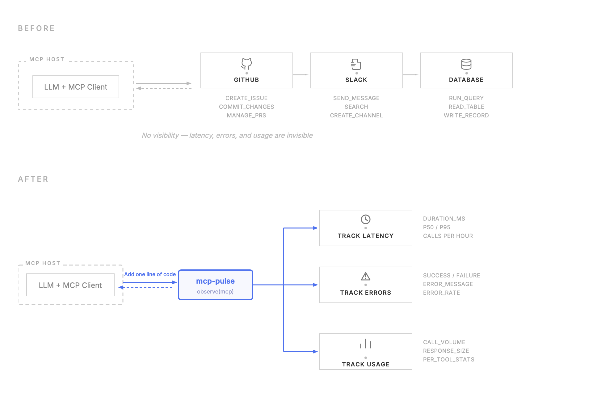

# mcp-pulse

Drop-in observability for MCP servers. Track tool calls, latency, errors, and usage with one line of code.

Give any MCP server instant visibility into what's happening — which tools are being called, how fast they respond, and what's failing.

## What it tracks

| Metric | Details |
|--------|---------|
| **Latency** | Duration per call, p50/p95 percentiles, calls per hour |
| **Errors** | Success/failure status, error messages, error rate |
| **Usage** | Call volume per tool, response size, per-tool breakdowns |
| **Dashboard** | Real-time web UI at `localhost:8020` with charts and recent call log |

## How it works



## Quick Start

### Install

```bash
pip install mcp-pulse
```

### Option 1: Replace FastMCP

```python
from mcp_pulse import ObserveMCP

# Replace FastMCP with ObserveMCP — that's it
mcp = ObserveMCP("my-server")

@mcp.tool()
def my_tool(param: str) -> str:
    """My tool description."""
    return f"result for {param}"

mcp.run(transport="stdio")
```

### Option 2: Wrap an existing server

```python
from mcp.server.fastmcp import FastMCP
from mcp_pulse import observe

mcp = FastMCP("my-server")

@mcp.tool()
def my_tool(param: str) -> str:
    return f"result for {param}"

observe(mcp)  # instruments all registered tools
mcp.run(transport="stdio")
```

Every tool call is now automatically tracked — tool name, duration, success/failure, response size.

## Dashboard

```bash
pip install mcp-pulse[dashboard]
mcp-pulse
```

Opens a web dashboard at `http://localhost:8020` showing:
- Total calls, error rate, avg latency
- Calls per hour chart
- Per-tool breakdown (call count, p50/p95 latency, error rate)
- Recent call log with timestamps

## Options

```python
mcp = ObserveMCP(
    "my-server",
    db_path="/path/to/custom.db",  # default: ~/.mcp-pulse/observe.db
    log_params=True,               # log input parameters (default: False)
)
```

## License

MIT
